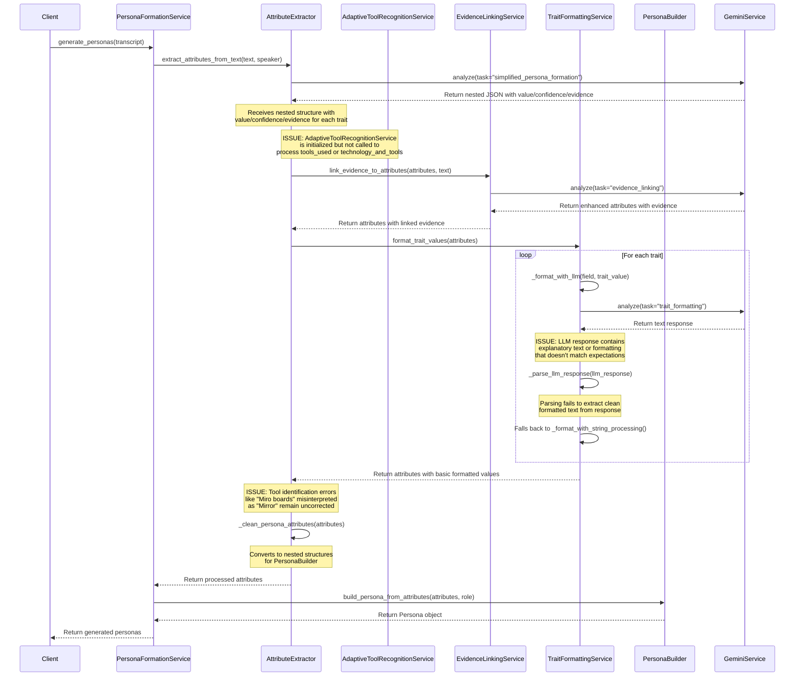
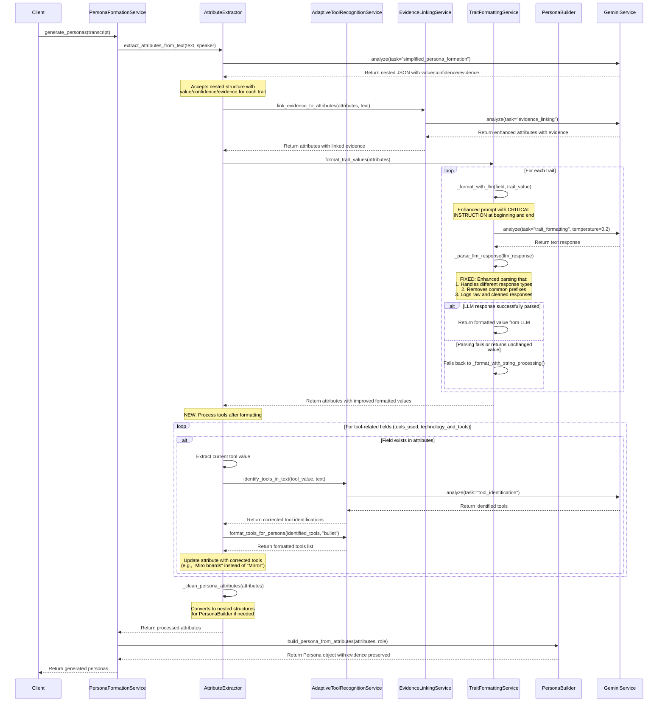

# Persona Generation Pipeline Improvements

## Overview

This document describes the improvements made to the persona generation pipeline, specifically addressing:

1. The TraitFormattingService LLM rephrasing issue
2. The proper integration of AdaptiveToolRecognitionService for tool identification

## Pipeline Flow

The persona generation pipeline follows this sequence:

1. **AttributeExtractor** extracts initial attributes from the transcript
2. **EvidenceLinkingService** links evidence to attributes
3. **TraitFormattingService** improves the formatting of trait values
4. **AdaptiveToolRecognitionService** identifies and corrects tool mentions
5. **PersonaBuilder** builds the final persona object

## TraitFormattingService Improvements

The TraitFormattingService has been enhanced to better handle LLM responses:

### Prompt Improvements

- Added clear, explicit instructions at the beginning and end of the prompt
- Emphasized that the LLM should return ONLY the rephrased text
- Provided specific formatting guidelines for different types of traits

### Response Parsing Improvements

- Enhanced parsing to handle different response types (dict, string, object)
- Added robust cleaning of common prefixes that LLMs might add
- Improved logging of both raw and cleaned responses
- Added validation to ensure the LLM actually improved the formatting

### Error Handling

- Added better fallback mechanisms when LLM formatting fails
- Improved logging to identify issues in the pipeline
- Added checks to skip formatting for very short trait values

## AdaptiveToolRecognitionService Integration

The AdaptiveToolRecognitionService has been properly integrated into the pipeline:

### Sequence Improvements

- Moved tool recognition to occur AFTER trait formatting but BEFORE converting to nested structures
- Removed the duplicate call to tool recognition at the beginning of the pipeline
- Added clear comments to indicate the correct sequence

### Tool Identification Improvements

- Enhanced tool identification to handle transcription errors (e.g., "Mirrorboards" → "Miro")
- Added evidence generation for identified tools
- Improved formatting of tool lists with bullet points

## Testing

A comprehensive test script has been created to validate the improvements:

- `test_trait_formatting()`: Tests the TraitFormattingService with various trait values
- `test_tool_recognition()`: Tests the AdaptiveToolRecognitionService with tool mentions
- `test_full_pipeline()`: Tests the full pipeline with a sample transcript

## Usage

To run the test script:

```bash
# Set the API key
export REDACTED_GEMINI_KEY=your_REDACTED_API_KEY

# Run the test script
python -m backend.tests.test_pipeline_improvements
```

## Sequence Diagrams

### Current Flow with TraitFormattingService Issue and Missing Tool Recognition



### Improved Flow with TraitFormattingService Fix and Tool Recognition Integration


